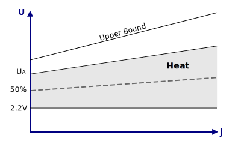

# Next Generation SIL Safety System Specification {.requirement status="proposed"}

## Version

- V1
- 20250925

## Functional Safety

- IEC61508
- SIL level 2

## Environmental
<!-- @include "Environmental.md#Temperature" level=2 -->
<!-- @include "Environmental.md#Altitude" level=2 -->
<!-- @include "Environmental.md#Ingress-Protection" level=2 -->
<!-- @include "Environmental.md#EMI-and-EMC" level=2 -->
<!-- @include "Environmental.md#Hazardous-Location" level=2 -->

## Electrical
<!-- @include "Electrical.md#Standard" level=2 -->
<!-- @include "Electrical.md#Supply" level=2 -->
<!-- @include "Electrical.md#Insulation-and-Isolation" level=2 -->
<!-- @include "Electrical.md#Creepage-and-Clearance" level=2 -->

## SIL Safety Algorithms

- TIHV slope modulated to electrolyzer temperature (see Verdagy)
- TIHV

dsgd sdg sdg sdg 

{#fig:trip width=200}

ghj hk mnb vbj

$$
\text{Upper Bound} = ((U_A - 2.2V) \times 1.5) + 2.2V
$$

blebleble

fdgfdg
fdgfd

- NILV
- NGHV
- AIHV

## Measurement Input

<!-- @include "Measurement-Input/*.md{.req_details}" level=2 -->

## Installation and Maintenance

- Calibration in situ (no more jig)
- Means of disconnecting measurement inputs during electrolyzer maintenance

## TEST TES TEST

$$
V_{od} = 
\frac{
2 \left[ (V_{in} + X)(1 - \beta_1) - (V_{in} - X)(1 - \beta_2) \right] + 2V_{ocm}(\beta_1 - \beta_2)
}{
(\beta_1 + \beta_2) \left( 1 + \frac{2}{a(f)(\beta_1 + \beta_2)} \right)
}
$$

