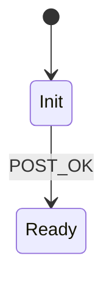

# SR.1.2.3 — Power-on self-test {.requirement status="proposed" sil="2" parent="SR.1.2"}

## DESCRIPTION
Short one-liner.

## DETAILS

1ere formule :

$P_\text{fail} < 10^{-6}$

2eme formule :

$$
\begin{aligned}
  a &= b + c \\
    &= d
\end{aligned}
$$

un diagram :

un peu plus sur les formules :

Inline: The mass–energy relation is $E = mc^2$.

A numbered display equation:

$$
\label{eq:einstein}
E = mc^2
$$

We refer to \eqref{eq:einstein}.

With pandoc-crossref instead:

$$ E = mc^2 $$ {#eq:einstein}

See @eq:einstein.
